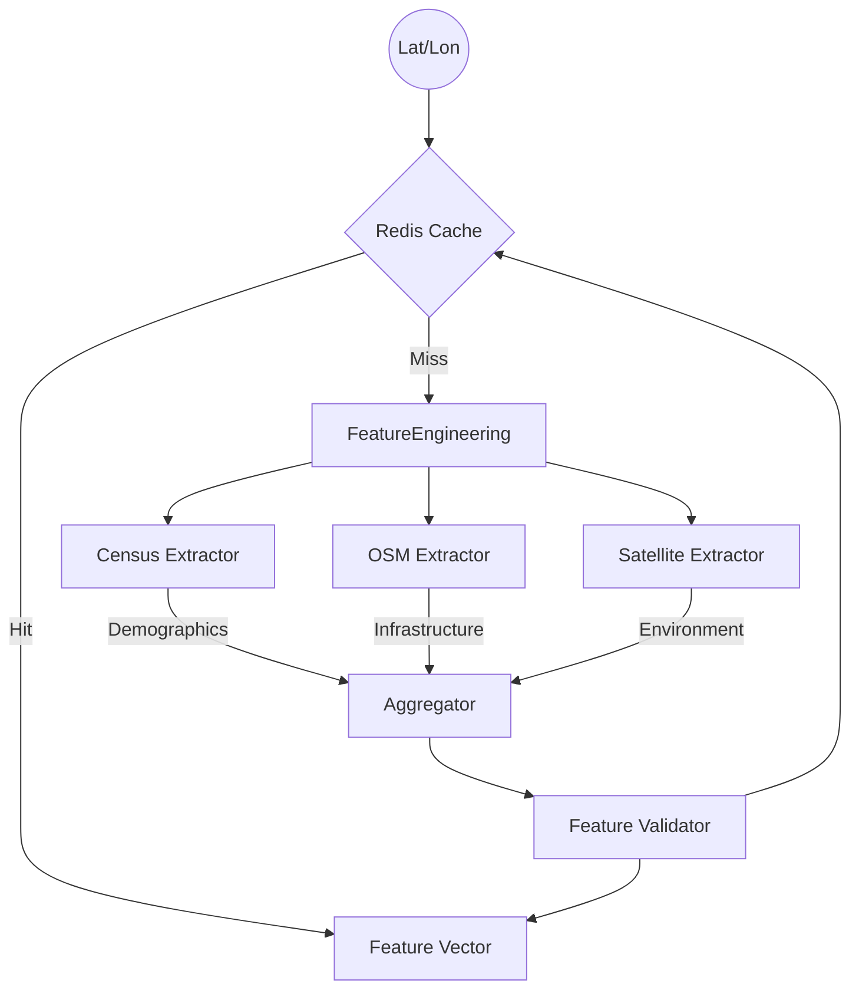

# Feature Engineering Guide

## Overview

This document explains the "Feature Set" used by our Abandoned Homes Prediction Model.
We extract **50+ features** from three primary data sources to build a holistic view of every location.

---

## 🏗️ Data Architecture

---

## 📊 Feature Dictionary

### 1. Demographic Features (Census)

_Source: US Census Bureau (ACS 5-year Estimates)_
_Update Frequency: Annually_

| Feature Name              | Description                     | Why it predicts abandonment                                                   |
| ------------------------- | ------------------------------- | ----------------------------------------------------------------------------- |
| `vacancy_rate`            | % of vacant housing units       | **Direct Indicator**. High vacancy (>10%) usually precedes total abandonment. |
| `poverty_rate`            | % population below poverty line | Economic distress prevents property maintenance.                              |
| `median_household_income` | Annual income ($)               | Lower income areas struggle with upkeep costs.                                |
| `population_change`       | % change over 10 years          | Depopulation leads to surplus housing supply.                                 |
| `owner_occupied_ratio`    | % owner vs renter               | Rentals are abandoned more often than owner-occupied homes.                   |

### 2. Spatial Features (OpenStreetMap)

_Source: OpenStreetMap Contributors_
_Update Frequency: Real-time (Cached weekly)_

| Feature Name           | Description                   | Why it predicts abandonment                                       |
| ---------------------- | ----------------------------- | ----------------------------------------------------------------- |
| `road_network_density` | km of road per km²            | Very low density = rural isolation. Very high = urban complexity. |
| `amenity_count`        | Schools, shops, etc. in 500m  | "Service Deserts" (0 amenities) correlate with decline.           |
| `grocery_store_dist`   | Meters to nearest supermarket | Food access correlates with neighborhood vitality.                |
| `building_density`     | Count of buildings in 200m    | Context: Is this a dense city block or a lone farmhouse?          |

### 3. Environmental Features (Satellite)

_Source: Sentinel-2 via Sentinel Hub_
_Update Frequency: Every 5 days_

| Feature Name    | Description                | Why it predicts abandonment                                                   |
| --------------- | -------------------------- | ----------------------------------------------------------------------------- |
| `ndvi_mean`     | Vegetation Index (-1 to 1) | **Overgrowth**. Unexpectedly high vegetation in urban area = neglected lawns. |
| `ndbi_mean`     | Built-up Index (-1 to 1)   | **Deterioration**. Changes in structural reflection.                          |
| `visual_change` | Pixel diff vs 1 year ago   | Detects demolition, fire damage, or collapse.                                 |

---

## 🛠️ Interpreting Values

When debugging model predictions, use these heuristics:

**The "Urban Decay" Signature:**

- `vacancy_rate` > 15%
- `poverty_rate` > 25%
- `property_value` < $50,000
- `amenity_count` < 2
- `ndvi_mean` > 0.6 (in summer)

**The "Rural Isolation" Signature:**

- `road_network_density` < 2.0
- `distance_to_grocery` > 5000m
- `population_density` < 100/km²

---

## ⚡ Performance & Caching

| Component | Avg Speed | Cache TTL | Notes                                            |
| --------- | --------- | --------- | ------------------------------------------------ |
| Census    | ~0.5s     | 365 Days  | Data only changes yearly. Aggressively cached.   |
| OSM       | ~2-5s     | 7 Days    | Network download is heavy. Radius affects speed. |
| Satellite | ~1-3s     | 7 Days    | Requires authenticating with Sentinel Hub.       |
| **Total** | **~5s**   | **N/A**   | **Batch processing recommended for >10 points.** |

**Rate Limits:**

- Sentinel Hub: 1000 requests/month (Free Tier)
- Census: 500 requests/day (without key), unlimited with key.

---

## 🚨 Troubleshooting

**Issue: All Satellite features are None**

- Check `SENTINEL_HUB_CLIENT_ID` in `.env`
- Area might be too cloudy (check `cloud_coverage` > 20%)

**Issue: Census data missing**

- Lat/Lon might be in the ocean or outside US.
- Verify coordinates are WGS84 (Lat, Lon).

**Issue: OSM is slow**

- Decrease `radius_meters`. 500m is optimal. 2000m+ is very slow.
